# DBProject – Phase 1

## Team Members
Meitav Bin Nun  
Efrat Hourvitz  

---

## Introduction

The general topic of the project is an **online store system**.  
Each team was required to focus on a specific department within the store.

Our team chose to focus on the **Customer Service department**.  
Therefore, the system we designed manages the information required for customer support operations, including customers, service requests, employees, products, and transactions related to customer inquiries.

---

# System Description

The goal of the system is to help customer service employees track customer activity, handle service requests, and view purchase information in order to provide better support.

The system manages the following main entities:

- **Customers** – store customer contact information.
- **Products** – represent products available in the online store.
- **Transactions** – represent purchases completed by customers on the website.
- **Requests** – represent customer service requests opened through the website.
- **Employees** – represent customer service employees that handle requests and assist customers.

### System functionality

Customers can perform purchases on the website, which are stored as **transactions** in the system.  
Customers can also open **service requests** when they encounter issues or need assistance.

Customer service **employees** handle these requests and may also assist customers regarding previous transactions.

The system allows tracking:

- customer purchases  
- customer service requests  
- employee handling of requests  
- relationships between customers, products, and transactions  

This information enables the customer service team to provide efficient support.

---

# ERD Diagram

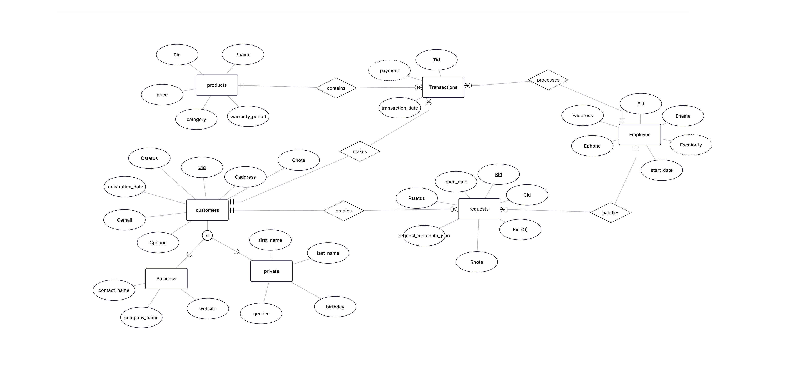

---

# DSD Diagram

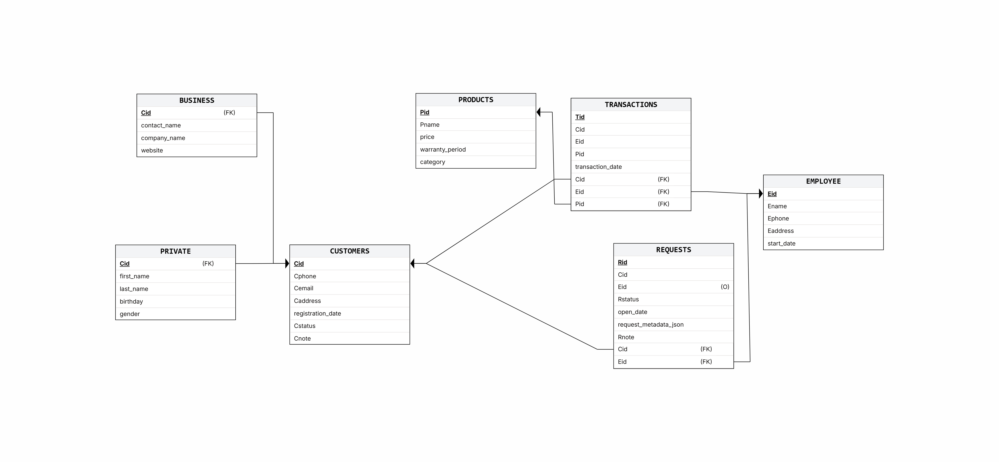

---

# Data Population Documentation

### Data Generation – Customers
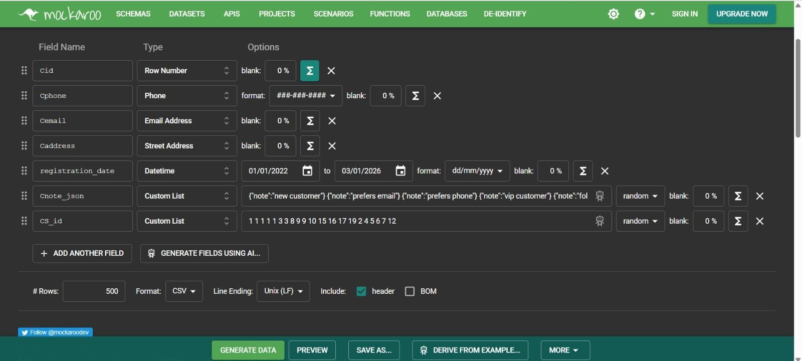

### Data Generation – Employees
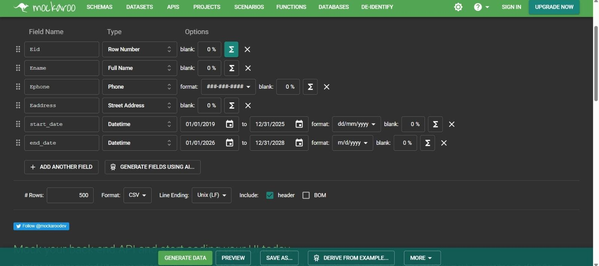

### Data Generation – Products
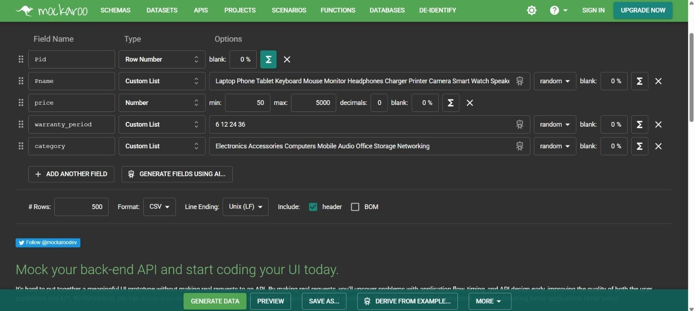

---

# Data Insertion Process

The data was inserted into the database in multiple stages:

1. Creation of tables using SQL scripts  
2. Generation of mock data using Mockaroo  
3. Importing CSV files into PostgreSQL  
4. Ensuring referential integrity using foreign keys  
5. Running validation queries to verify correctness  

---

# System Screens

### Login Screen
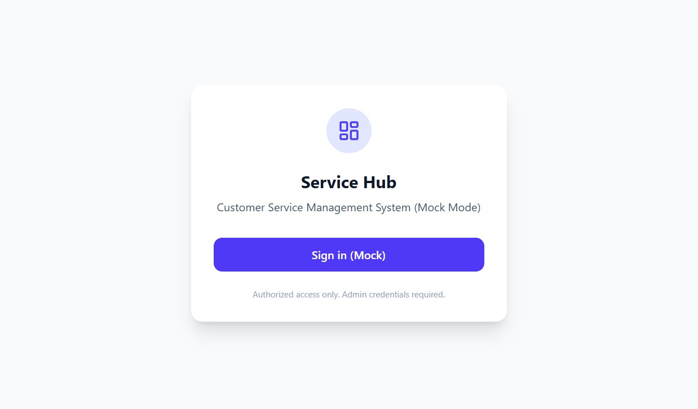

---

### Dashboard
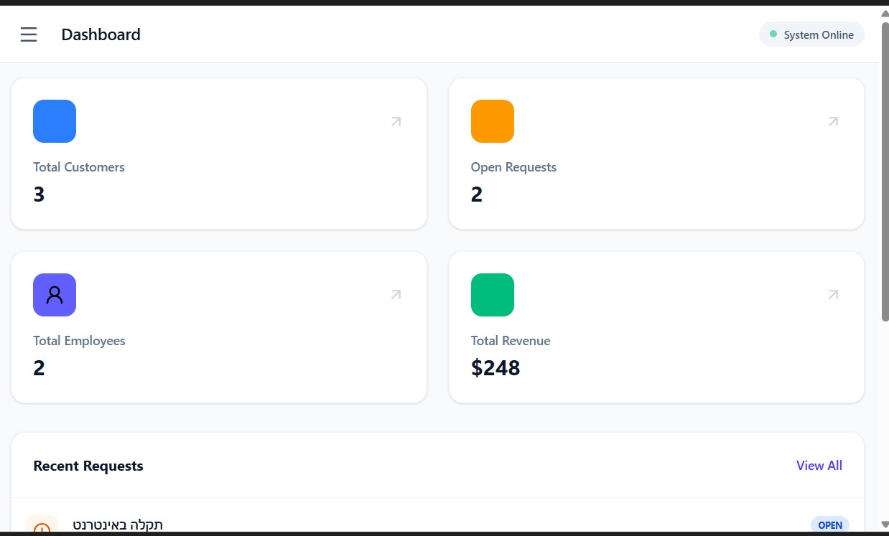

---

### Customers Screen
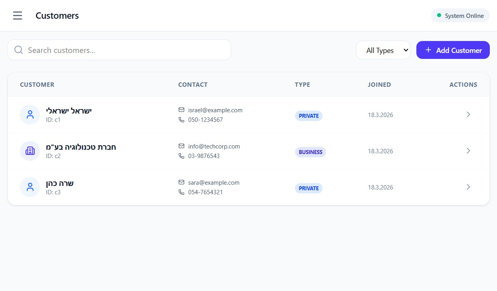

---

### Products Screen
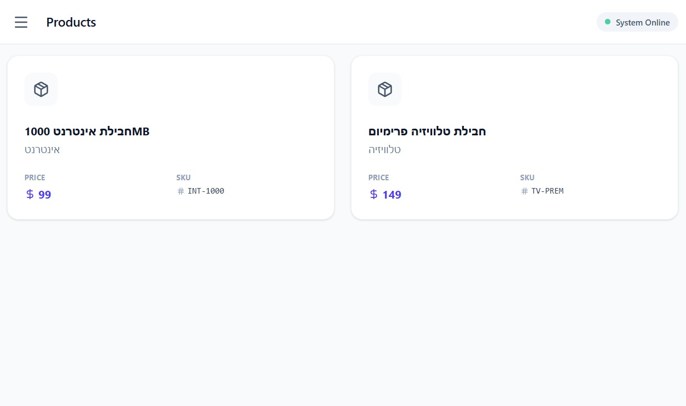

---

### Employees Screen
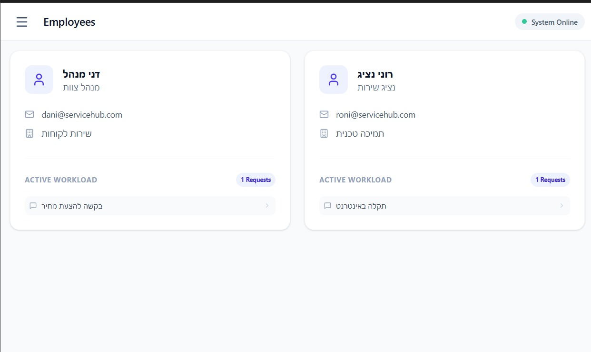

---

### Requests Screen
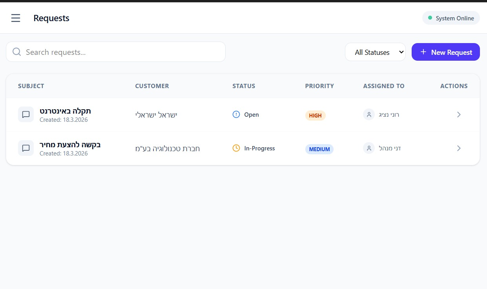

---

### Transactions Screen
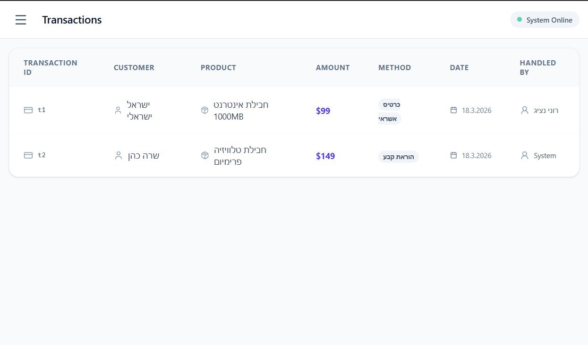

---

# Backup

A full backup of the database was created.

The backup includes:

- Database structure (tables, relationships, constraints)  
- All inserted data  

Backup file:
